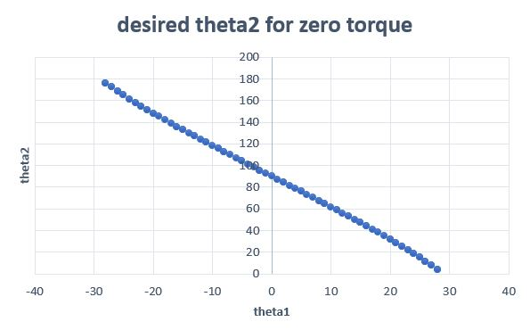

# inverted double pendulum

using the torque equation, we were able to empirically find the angle pairs that will return a zero torque. the linear relationship of theta1 and theta2 is then used to determine the motor angle needed.

